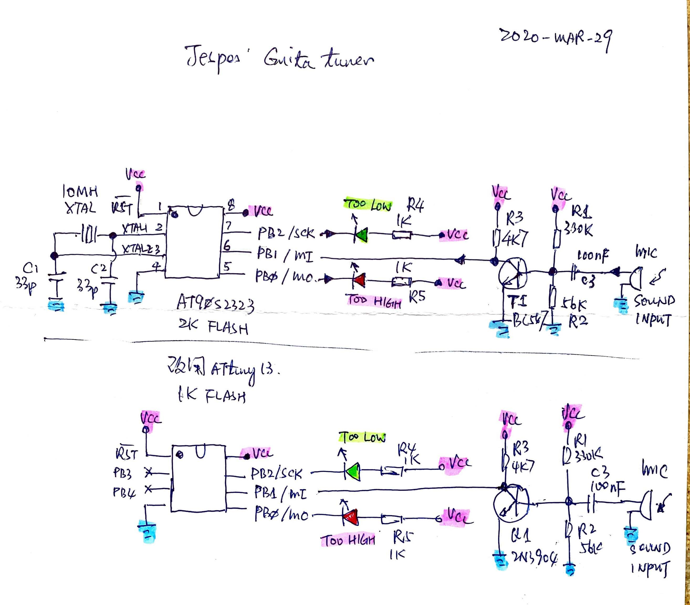

## C code only

uses ARduino IDE or direct avr-gcc to compile, both ok.  


## Reference : 
Jesper_Attiny2323, it was design by Jesper and AT90S2323 used, about 20 years ago.

## Goal : 
build a toy.  
try to port to uses Attiny13 of which is almost pin-to-pin compatible with obsolete AT90S2323, both are 8-pin device.


## compile and batch file

set the soruce code as 'main'

```
set main=gtuner_tiny13.ino
```  

compiler option, specify *.ino rather than general *.c

```
avr-gcc.exe -xc -Os -mmcu=at%mcu% -Wall -g -o %main%.out *.ino
```  
  
complete batch file, 

```
@echo off

set mcu=tiny13

set main=usart_print0xff.ino
set ac=C:\WinAVR-20100110

path %ac%\bin;%ac%\utils\bin;%path%

avr-gcc.exe -dumpversion
avr-gcc.exe -xc -Os -mmcu=at%mcu% -Wall -g -o %main%.out *.ino

::avr-gcc.exe -O2 -Wl,-Map,%1.map -o %1.out %1.c %2 %3 -mmcu=at%mcu%
cmd /c avr-objdump.exe -h -S %main%.out >%main%.lst
cmd /c avr-objcopy.exe -O ihex %main%.out %main%.hex
avr-size.exe %main%.out
del %main%.out

::goto end
::pboot.exe -c1 -b19200 -p%main%.hex
::l.exe -b9600
:end
```

## note

timer0 ISR routine, revised. vector, TIM0_OVF_vect, address is 0x0003

define cbi / sbi to support deprecated marco and code style. see https://www.nongnu.org/avr-libc/user-manual/group__avr__sfr.html

add name for pin & functions
#define LED_HI PB0  
#define MIC_IN PB1  
#define LED_LO PB2  
  
## source code  

  
## firmware image  
  
  
## Attiny13 data sheet, (Atmel) now is Microchip 
  


